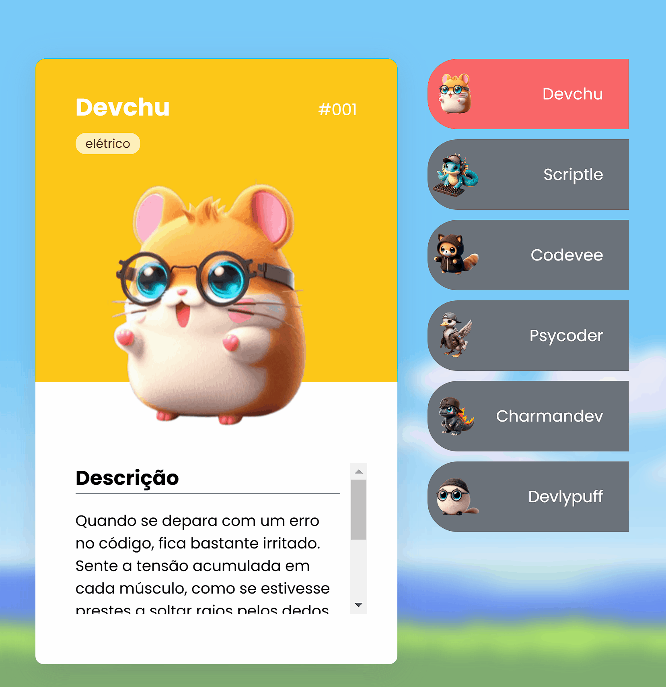

# Projeto com README
Um projeto de teste com um arquivo README 🧑🏻‍💻

[](https://pedroclaro17.github.io/First-Project-Pokedevs/)

## Tecnologias utilizadas
-HTML
-CSS
-JS

## Como utilizar
1-Clone o projeto
```
git clone https://pedroclaro17.github.io/First-Project-Pokedevs/
```
2-Acesse o repositório
```
cd repositorio-com-readme
```


